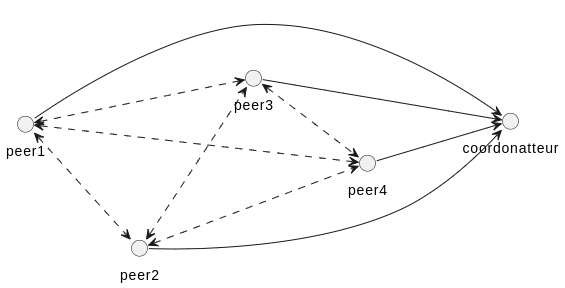
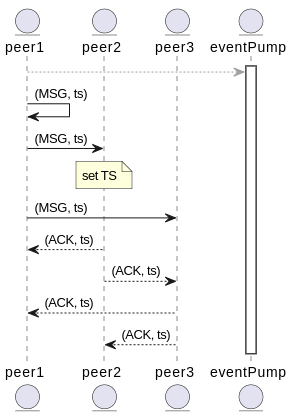
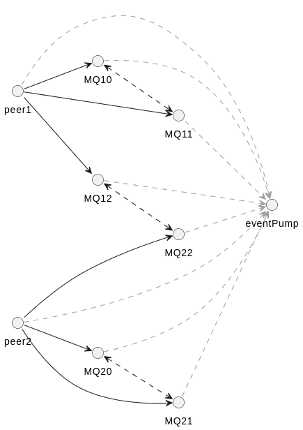

**Membres du groupe**
|Noms|Email|Identifiant github|
|:-----:|:---------:|:----------:|
|DOUANLA MELI Scott|scott.douanla-meli@etu.univ-grenoble-alpes.fr|McScotti|
|NGUEGANG KOWO Laura Stefy|laura-stefy.nguegang-kowo@etu.univ-grenoble-alpes.fr|Stefy237|


# DESIGN

Notre implémentation repose sur trois couches :

* Broker / Channel
Modèle bas-niveau threading, full-duplex, bloquant.

* QueueBroker / MessageQueue (évènementiel)
Surcouche non-bloquante permettant d’utiliser une pompe à évènements.

* Layer Multicast avec horloge de Lamport
Implémentation du Totally Ordered Multicast (TOM) basée sur les MessageQueues.

## Creaton du groupe



**Peer — un objet Peer** :
Un peer représente un participant au groupe. Chaque instance de Peer contient :
    * QueueBroker : pour gérer les connexions réseau.
    * List<MessageQueue> : une file de messages vers chaque voisin.
    * EventPump : pour traiter tous les évènements applicatifs dans un thread unique.
    * LamportClock : horloge logique pour ordonner les messages.
    * received_ack : Map<Timestamp,List<Integer>> : Garde la liste des ACK reçus pour chaque message.
    * received_messages : Map<Timestamp,Message> : Hold-back queue triée par timestamp.

Le Peer rejoint directement un groupe dédié à sa création puis se met en écoute des possible connexions.

L’EventPump garantit :
* un traitement séquentiel et sans course critique
* une logique applicative sans verrou
* l’exécution du protocole TOM sans interblocage

Toutes les opérations réseau (connect, accept, read, write) tournent dans des threads séparés, et seulement la logique applicative est postée dans la pompe.

### Coordinator – Validation du protocole

Le Coordinator est un composant de test unitaire. IL a pour rôle de
- Recevoir les notifications de délivrance (DELIVER_NOTIFY) envoyées par chaque peer
- Enregistrer les ordres locaux de livraison
- Vérifier :
    * l’unicité des messages
    * la correspondance exacte entre les ordres locaux
    * la cohérence des timestamps

C’est cet outil qui permet de valider expérimentalement l’implémentation du TOM.

## Envoie des messages multicast





Chaque Peer reçoit tous les messages (y compris les siens). La pompe d’événements garantit un traitement séquentiel, sans thread-safety complexe.
Les ACKs (ici, assurer uniquement avec les timestamp) assurent la confirmation totale : on ne livre que lorsque tous ont vu le message.

Lorsqu'un peer veut diffuser le message au groupe : 
1. tick de l’horloge Lamport → timestamp = clock.increment()
2. Création d’un objet Message(msg, timestamp)
3. Sérialisation via MessageSerializer
4. Diffusion sur tous les voisins via MessageQueue.send()

```
public void multicast(String msg,int id) {
        if(queues.size()<neighbors){
            Runnable R = new Runnable() {

                @Override
                public void run() {
                    Peer.this.multicast(msg, id);
                }
            };
            EExecutor.instance().post(R);
        }else{
            Message message = new Message(msg);
            Timestamp timestamp = new Timestamp(this.id, lamportClock.tick());
            message.set_timestamp(timestamp);
            byte[] b = MessageSerializer.serialize(message);
            queues.get(0).send(b);
            for(MessageQueue q : queues){
                q.send(b);
                System.out.println("j'ai  ecrit pour un "+id);
            } 
        }
        
    }
```

## Reception des messages multicast

Chaque MessageQueue installe un listener :
- La réception brute se fait dans un thread I/O.
- Le listener appelle pump.post(() -> received(msg)).
- Le traitement applicatif se fait dans la pompe, garantissant l’ordre.

```
public void listen(MessageQueue queue){
        System.out.println("j'ai recu un messageeeeee");
        queue.receive(new MessageQueue.Listener() {

            @Override
            public void received(byte[] msg) {
                Object message = MessageSerializer.deserialize(msg);
                //System.out.println("j'ai recu un message");
                if(message instanceof Timestamp){
                    Timestamp timestamp = (Timestamp)message;
                    received_ack.get(timestamp).add(timestamp.get_id());
                    System.out.println("j'ai recu un message");
                    deliver();
                    System.out.println("j'ai delivre un message");
                    listen(queue);
                }else if(message instanceof Message){
                    Message m = (Message)message;
                    received_ack.put(m.get_timestamp(), new ArrayList<Integer>());
                    received_messages.put(m.get_timestamp(), m);
                    lamportClock.update(m.get_timestamp().get_clock());
                    deliver();
                    listen(queue);
                }
                
            }

            @Override
            public void closed() {
                // TODO Auto-generated method stub
                throw new UnsupportedOperationException("Unimplemented method 'closed'");
            }
            
        });
    }
```

**Accusés de réception (ACK)**
À chaque réception d’un message Message(timestamp), le peer :
- ajoute le message à received_messages
- initialise received_ack pour ce message
- diffuse immédiatement un ACK

Ce mécanisme garantit que tous les peers ont connaissance du message avant livraison → c'est la propriété d’ordre total


## Livraison des messages

Un message n’est livrable que si :
- tous les peers ont envoyé un ACK pour ce message
- il est en tête de la file (ordre minimum)

```
public void deliver(){
    Timestamp mintTimestamp = Collections.min(received_messages.keySet());
    if(PFD.verify_my_acks(received_ack.get(mintTimestamp))){
    }
}
```
La fonction verify_my_acks() vérifie que tous les membres du groupe ont accusé réception.

# TESTS

Nous avons réaliser un test de charge verifiant la connexions entre les peer et l'envoie/reception des messages

Pour lancer automatiquement les tests via ant : 
- Pour valider l'exécution de la couche Broker/Channel
``` ant run-test``` 

- Pour valider le modèle évenementiel
``` ant run-event ```

- Pour valider le multicast
``` ant run-multicast ```

