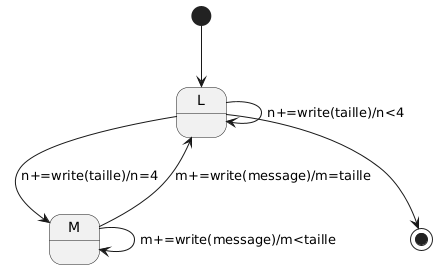
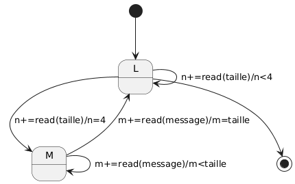

# QueueBroker

- accept: cette methode appele la methode accept sur le broker du Queuebroker avec les memes arguments , le channel recupere est ensuite utilise pour construire une queue
- connect: cette methode appele la methode connect sur le broker du Queuebroker avec les memes arguments, le channel recupere est ensuite utilise pour construire une queue


# MessageQueue

un objet messagequeue est une surcouche sur un channel qui permet d'envoyer des messages de tailles variable en entier .

## Sending



- l'etat L est celui dans lequel on ecrit la taille du message et n est le nombre de bytes lus
- l'etat M est celui dans lequel on ecrit le message en lui meme et m est le nombre de bytes lus

lorsque la queue est fermee pendant qu' une operation ```send``` est en cours celle ci se termine tout de meme .

## Receiving



- l'etat L est celui dans lequel on lit la taille du message et n est le nombre de bytes lus
- l'etat M est celui dans lequel on lit le message en lui meme et m est le nombre de bytes lus

lorsque la queue est fermee pendant qu' une operation ```receive``` est en cours celle ci se termine tout de meme .

## closing

- close: cette methode appele la methode ```disconnet()``` sur le channel de la queue
- closed: cette methode appele la methode ```disconneted()``` sur le channel de la queue et remonte la valeur retournee